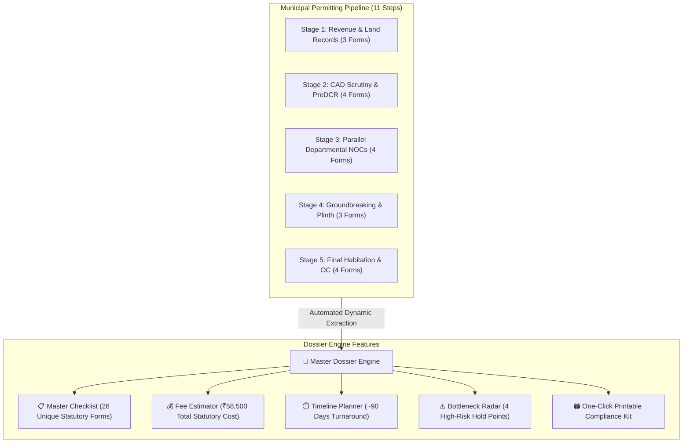

# 📁 Master Dossier & Document Kit: Complete Technical & User Guide

## 1. What is a "Master Dossier"?

In administrative, municipal, and legal governance, a **Dossier** (pronounced */ˈdɒsieɪ/* or *dos-ee-ay*) is the **definitive collection of all legal records, affidavits, title extracts, site plans, and No-Objection Certificates (NOCs)* required to execute a statutory municipal project.

In **CivicPath Visualizer**, the **Master Dossier** is an automated document aggregation and compliance tracking engine that eliminates the biggest point of failure in Indian municipal permitting: **scattered, missing, or delayed paperwork**.

---

## 2. The Real-World Civic Problem

When a citizen applies for a **Residential Building Permission (Bungalow/G+2)** under the Maharashtra Unified Development Control and Promotion Regulations (**UDCPR 2020**) or municipal bylaws:

```
                  ┌────────────────────────────────────────────────────────┐
                  │          The Traditional Bureaucratic Cycle            │
                  └────────────────────────────────────────────────────────┘
                                              │
                ┌─────────────────────────────┼────────────────────────────┐
                ▼                             ▼                            ▼
      Revenue Department             Town Planning Cell             Tree Authority
    (7/12, Property Card)         (PreDCR CAD, FSI Tables)      (Census Form A, Affidavit)
                │                             │                            │
                └─────────────────────────────┼────────────────────────────┘
                                              ▼
                        Citizen visits office unprepared
                                              ▼
                    "Missing Compensatory Tree Affidavit!"
                                              ▼
                                 Weeks of Administrative Delay
```

### Key Obstacles for Citizens & Architects:
1. **Departmental Silos**: Paperwork is demanded by 5+ independent municipal wings (Revenue, TILR, Town Planning, Tree Authority, Hydraulic/Drainage Dept).
2. **Sequential Surprises**: Citizens only learn about a required form when they reach that specific window at the municipal council.
3. **No Centralized Checklist**: Government portals only list documents relevant to their own department, not the full pipeline.

---

## 3. How the Master Dossier Solves This

The **Master Dossier** dynamically aggregates all requirements across every stage of the Directed Acyclic Graph (DAG) into an actionable, unified preparation kit:



---

## 4. Master Dossier Features Breakdown

### 1. Unified Statutory Document Extraction
The engine automatically deduplicates and groups all submissions across the DAG:
- **Land Title Proofs**: 7/12 Extract (Mahabhulekh), Property Register Card (मालमत्ता पत्रक), Search Index-II.
- **Cadastral Surveys**: Demarcation Form No. 1, Certified Mojani Sheet (मोजणी नकाशा).
- **Architectural Scrutiny**: Appendix A-1, Appendix B Architect Supervision Certificate, PreDCR CAD Drawing (.dwg), Structural Stability Certificate.
- **Parallel Departmental NOCs**: Tree Census Form A, Compensatory Plantation Affidavit, Water Connection Form, Stormwater Invert Level Plan.
- **Groundbreaking & Plinth**: Appendix C (Commencement Certificate), Labor Cess Challan, Appendix G (Plinth Notice).
- **Habitation Clearances**: Appendix H (Architect Completion), Drainage Connection Certificate, Appendix I (Occupancy Certificate).

### 2. Interactive Document Gather Tracker
- Each form includes a persistent toggle checkbox.
- As the citizen or architect collects physical copies, clicking the checkbox marks the item gathered:
  $$\text{Progress} = \frac{\text{Collected Forms}}{\text{Total Required Forms}} \times 100\%$$
- Real-time counter badge displayed in the sidebar tab: `4/26 Gathered`.

### 3. Pipeline Scrutiny Metrics Banner
At a single glance, users see high-level statutory projections:
- **Total Estimated Duration**: `~90 Days` (based on Maharashtra Right to Public Services Act standards).
- **Statutory Fee Burden**: `₹58,500` (government scrutiny fees, demarcation charges, and labor cess).
- **Required Clearances**: `26 Clearances`.
- **Known Bottlenecks**: `4 Critical Points` flagged with amber badges where physical inspections or tree clearances create administrative friction.

### 4. Search & Filter Bar
Instantly filters the 26+ documents by keyword (e.g. typing `"Tree"`, `"CAD"`, `"Mojani"`, or `"Receipt"`).

### 5. Official Print Kit (`window.print()`)
Clicking **"Print Kit"**:
- Strips out the dark-mode graph canvas.
- Renders a clean, high-contrast, black-and-white physical document checklist.
- Generates a title banner with Jurisdiction (`Urban Local Bodies across Maharashtra`), Legal Reference (`MRTP Act 1966 & UDCPR 2020`), and checkboxes for physical folder organization.

---

## 5. Master Dossier vs. Step Inspector

| Capability | 📁 Master Dossier (`activeTab === 'kit'`) | 🔍 Step Inspector (`activeTab === 'inspector'`) |
| :--- | :--- | :--- |
| **Scope** | **Entire Project Pipeline (Macro View)** | **Single Selected Milestone (Micro View)** |
| **Target User** | Property owner, legal consultant, or head architect preparing the overall project dossier. | Draftsman, civil engineer, or applicant executing a specific statutory window. |
| **Primary Data** | Aggregated unique forms, global fees in ₹, global duration in days, full project checklist. | Plain-language rationale, statutory bylaws (e.g., UDCPR Reg 2.2.3), official portal URL, link connectivity status. |
| **Core Action** | Checking off physical documents & printing the dossier binder. | Inspecting legal rules, opening state portals (Aaple Sarkar / MahaBPAMS), testing live server connectivity. |

---

## 6. Code Implementation Reference

- **Sidebar Drawer Implementation**: [DocumentDrawer.jsx](file:///c:/Users/LENOVO/OneDrive/Desktop/Vertex/client/src/components/sidebar/DocumentDrawer.jsx)
  - Tab 1: `activeTab === 'kit'` (Master Dossier & Checklist)
  - Tab 2: `activeTab === 'inspector'` (Node Deep Dive)
- **Topological Graph Canvas**: [RoadmapCanvas.jsx](file:///c:/Users/LENOVO/OneDrive/Desktop/Vertex/client/src/components/graph/RoadmapCanvas.jsx)
- **Custom React Flow Node**: [CivicNode.jsx](file:///c:/Users/LENOVO/OneDrive/Desktop/Vertex/client/src/components/graph/CivicNode.jsx)
- **Print Stylesheet Integration**: [index.css](file:///c:/Users/LENOVO/OneDrive/Desktop/Vertex/client/src/index.css#L26-L53)
- **Statutory Permitting Dataset**: [contracts/graph-spec.json](file:///c:/Users/LENOVO/OneDrive/Desktop/Vertex/contracts/graph-spec.json)
