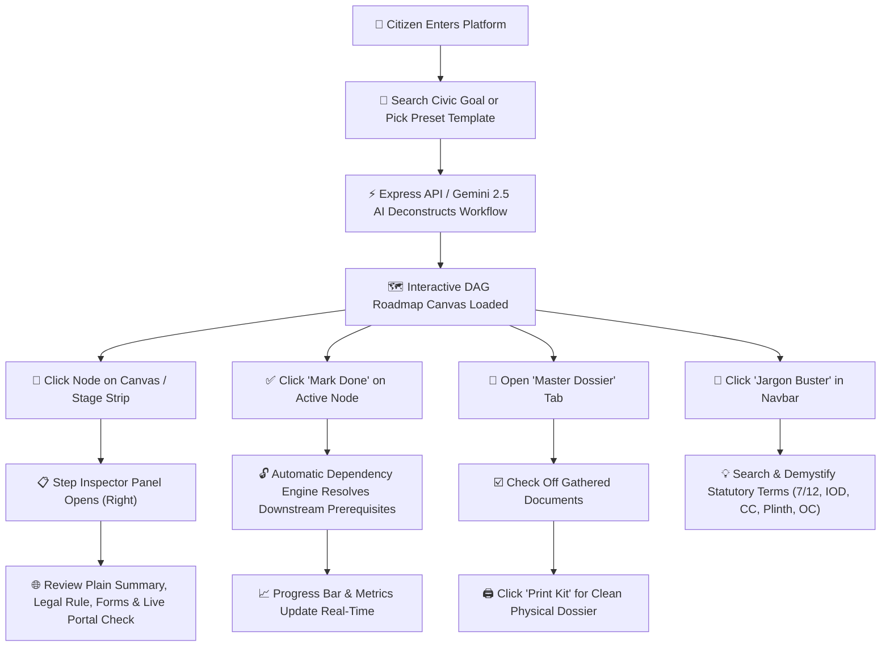
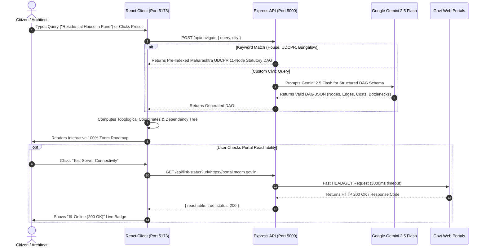

# 🗺️ CivicPath Visualizer: Exact UI & Data Flow Architecture

This document specifies the exact component hierarchy, user interaction paths, state machine transitions, and data pipeline flows for the **Municipal Bureaucracy Path Visualizer**.

---

## 1. High-Level User Journey Flow



---

## 2. Component Hierarchy & Layout Structure

```
App.jsx (Root Application & Global State)
├── Header Bar
│   ├── Logo & Brand Title ("CivicPath Visualizer")
│   ├── Civic Search Form + "Deconstruct" Button (AI Engine)
│   ├── Quick Templates Bar (Residential UDCPR / Cloud Kitchen / Gumasta)
│   ├── "Jargon Buster" Action Button
│   └── Mobile Drawer Toggle (Hamburger Menu)
│
├── Main Workspace Layout (2-Column Responsive Grid)
│   │
│   ├── [Left 70%] RoadmapCanvas.jsx (ReactFlow Wrapper)
│   │   ├── Stage Fast-Navigator Strip (Stage 1 to Stage 5)
│   │   ├── Top-Left Controls Toolbar:
│   │   │   ├── Live Progress Pill (e.g., 4 / 11 Done - 36%)
│   │   │   ├── "Next Step" Auto-Focus Button
│   │   │   ├── "100% Zoom" Quick Reset
│   │   │   ├── Orientation Switcher (Vertical Hierarchy ⇄ Horizontal View)
│   │   │   └── Fit Viewport Button
│   │   ├── Custom Civic Nodes (CivicNode.jsx)
│   │   │   ├── Top/Left Target Handle
│   │   │   ├── Stage Pill & Actionable/Done/Locked Status Badge
│   │   │   ├── Official Step Title & Department Tag
│   │   │   ├── Statutory Legal Rule Citation (e.g., UDCPR Reg 2.2.3)
│   │   │   ├── Turnaround Time (Clock) & Statutory Fees (₹ Rupee)
│   │   │   ├── Known Bottleneck Alert Banner (if applicable)
│   │   │   ├── Quick Status Action Button ("Mark Done" / "Unlock")
│   │   │   └── Bottom/Right Source Handle
│   │   ├── Glowing Animated Edges (Smoothstep with Label Badges)
│   │   ├── Canvas MiniMap & Zoom/Pan Controls
│   │   └── Bottom Legend Panel
│   │
│   └── [Right 30% / 420px] DocumentDrawer.jsx (Sidebar Panel)
│       ├── Tab Switcher ("Master Dossier" ⇄ "Step Inspector")
│       │
│       ├── Tab 1: Master Dossier (DocumentKit)
│       │   ├── Statutory Metrics Banner (Total Days, Fees ₹, Forms Count, Bottlenecks)
│       │   ├── Print Kit Button (Formatted window.print() Dossier)
│       │   ├── Search Filter for Required Forms
│       │   └── Interactive Form Checkboxes (Gathered vs Pending)
│       │
│       └── Tab 2: Step Inspector (Node Deep Dive)
│           ├── Selected Step Header Card & Department
│           ├── Plain-Language Citizen Explanation Card
│           ├── Statutory Rule & Section Card (MRTP / UDCPR)
│           ├── Forms & Submission List Checklist
│           └── Official Government Portal Card + "Test Server Connectivity" Live Ping
│
└── JargonBusterModal.jsx (Accessible Lexicon Dialog)
    ├── Search Input by Term, Abbreviation, or Rule
    └── Indexed Civic Lexicon Cards (7/12, Mojani, AutoDCR, IOD, CC, Plinth, OC, etc.)
```

---

## 3. Node State Machine & Unlocking Logic

Each node in the municipal Directed Acyclic Graph (DAG) transitions through 3 statutory states:

```mermaid
stateDiagram-v2
    [*] --> Locked : Has Uncompleted Prerequisite Parent Nodes
    [*] --> Available : Root Node (0 Prerequisites)
    
    Locked --> Available : All Parent Nodes Marked "Completed"
    Available --> Completed : Citizen Clicks "Mark Done"
    Completed --> Available : Citizen Clicks "Completed" (Undo Action)
    
    state Available {
        description: "🔵 Blue Glowing Ring, 'Actionable' Status"
        ready: "Prerequisites satisfied. Citizen can submit applications."
    }
    
    state Completed {
        description: "🟢 Emerald Glowing Ring, 'Done' Status"
        ready: "Statutory permission granted. Triggers downstream unlocks."
    }
    
    state Locked {
        description: "⚪ Muted Slate Border, 'Prereq Locked' Status"
        ready: "Cannot apply yet. Prior statutory clearances needed."
    }
```

---

## 4. End-to-End Data & API Pipeline



---

## 5. UI Action & Navigation Matrix

| Screen Area | User Action | System Reaction |
| :--- | :--- | :--- |
| **Top Navigation** | Selects Preset ("Commercial Cloud Kitchen") | Queries backend, replaces current DAG with new workflow, focuses camera on Step 1. |
| **Search Input** | Types custom goal and clicks **Deconstruct** | Triggers AI DAG generator or keyword normalizer; loads generated DAG. |
| **Stage Navigator** | Clicks `Stage 3: Parallel NOCs` | Canvas smoothly pans and zooms directly to Stage 3 nodes at 95% scale. |
| **Quick Toolbar** | Clicks `Next Step` | Camera automatically locks onto the first available active node in the pipeline. |
| **Canvas Node** | Clicks anywhere on node card | Highlights card with indigo glow, switches right sidebar to **Step Inspector** tab. |
| **Status Button** | Clicks `Mark Done` on node | Sets node state to **Completed** (emerald); unlocks downstream child nodes. |
| **Master Dossier** | Clicks document checkbox | Toggles gathered state, updates gathered count (`x / 26 gathered`). |
| **Print Button** | Clicks `Print Kit` | Opens browser print dialog formatted to print only the official checklist & summary. |
| **Portal Checker** | Clicks `Test Server Connectivity` | Probes government portal live and renders real-time status code badge. |
| **Jargon Buster** | Clicks `Jargon Buster` in navbar | Opens searchable modal with plain-language definitions for legal abbreviations. |

---

## 6. Directory File Map

- **Root Guide**: [UI_FLOW_ARCHITECTURE.md](file:///c:/Users/LENOVO/OneDrive/Desktop/Vertex/UI_FLOW_ARCHITECTURE.md)
- **Top-Level App Shell**: [client/src/App.jsx](file:///c:/Users/LENOVO/OneDrive/Desktop/Vertex/client/src/App.jsx)
- **Interactive DAG Canvas**: [client/src/components/graph/RoadmapCanvas.jsx](file:///c:/Users/LENOVO/OneDrive/Desktop/Vertex/client/src/components/graph/RoadmapCanvas.jsx)
- **Custom React Flow Node**: [client/src/components/graph/CivicNode.jsx](file:///c:/Users/LENOVO/OneDrive/Desktop/Vertex/client/src/components/graph/CivicNode.jsx)
- **Dossier & Inspector Drawer**: [client/src/components/sidebar/DocumentDrawer.jsx](file:///c:/Users/LENOVO/OneDrive/Desktop/Vertex/client/src/components/sidebar/DocumentDrawer.jsx)
- **Civic Glossary Modal**: [client/src/components/common/JargonBusterModal.jsx](file:///c:/Users/LENOVO/OneDrive/Desktop/Vertex/client/src/components/common/JargonBusterModal.jsx)
- **Backend Express Router**: [server/src/index.js](file:///c:/Users/LENOVO/OneDrive/Desktop/Vertex/server/src/index.js)
- **Statutory UDCPR Dataset**: [server/src/data/seed_cases.json](file:///c:/Users/LENOVO/OneDrive/Desktop/Vertex/server/src/data/seed_cases.json)
