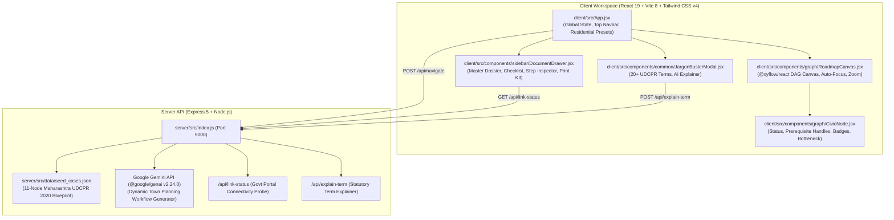

`#` Vertexa Project: Comprehensive Audit & Reconciliation Report
```
```

**Repository**: [AnushkaS-09/Vertexa](https://github.com/AnushkaS-09/Vertexa)  
**Intended Product Scope**: *Building Plan Approval & Construction Permitting — Building Permission & Statutory NOC Clearances for Residential Houses in Maharashtra (UDCPR 2020 / MRTP Act 1966).*  
**Audit Date**: September 27, 2026  
**Status**: Read-Only Reconciliation Phase Complete (No files modified during audit)

---

## 1. Executive Architecture Summary

Vertexa is structured as a full-stack civic workflow navigation platform designed to demystify complex municipal bureaucracy for citizens and architects building residential houses in Maharashtra:



---

## 2. Comprehensive 24-Item Audit Breakdown

| # | Audit Item | Current Status | Evidence / Files | Risk Level | Proposed Fix | Requires Your Approval? |
| :-: | :--- | :--- | :--- | :---: | :--- | :-: |
| **1** | **Gemini Model Configuration** | **NEEDS TECHNICAL VERIFICATION** | `server/src/index.js` (lines 102 & 197: `gemini-3.8-flash`) | **Medium** | Switch from non-standard model string to production-stable `gemini-2.0-flash` or `gemini-1.5-flash` to prevent 404 Model Not Found errors on standard API keys. | **Yes** |
| **2** | **Gemini API Key Architecture** | **ALREADY IMPLEMENTED** | `server/src/index.js` (line 13), `server/.env`, `server/.env.example` | **Low** | Key is strictly loaded server-side via `process.env`. `.env` is ignored by git, `.env.example` contains only empty placeholders, and no keys exist in client bundles. | **No** |
| **3** | **Gemini Structured Output & Validation** | **PARTIALLY IMPLEMENTED** | `server/src/index.js` (lines 105 & 200) | **Medium** | `responseMimeType: 'application/json'` is active, but response schema is not enforced via `responseSchema` or Zod. Add explicit node/edge schema validation before sending to React Flow. | **Yes** |
| **4** | **Gemini Failure / Fallback Visibility** | **NOT IMPLEMENTED** | `server/src/index.js` (lines 114–133) | **Low** | When Gemini fails/times out, HTTP 200 serves `seedCases[0]` without a `source: 'live_ai' \| 'curated_seed'` field. Add an unobtrusive badge in UI. | **Yes** |
| **5** | **Live Government-Source Grounding** | **NOT IMPLEMENTED** | `server/src/index.js` (lines 60–134) | **Low (Scope)** | `/api/navigate` currently uses internal prompts and seed datasets without live web search. Live search requires Gemini Google Search Grounding or an external search API restricted to `*.gov.in`. | **Yes (Decision)** |
| **6** | **Structured Plot-Detail Intake** | **NOT IMPLEMENTED** | `client/src/App.jsx` (lines 323–355) | **Low (Scope)** | UI has a search query text box and city selector, but does not yet have a multi-field plot questionnaire (area, height, road width, trees, heritage, airport zone). | **Yes (Decision)** |
| **7** | **Eligibility / Deterministic Rules Engine** | **NOT IMPLEMENTED** | `server/src/index.js` | **Low (Scope)** | Permitting logic is currently statutory blueprint-based rather than an algorithmic rule tree (`height > 15m -> Fire NOC`). | **Yes (Decision)** |
| **8** | **"Applies to You / Does Not Apply" Section** | **NOT IMPLEMENTED** | `client/src/components/sidebar/DocumentDrawer.jsx` | **Low (Scope)** | The UI currently shows the active DAG workflow. It does not display an exclusion list with reasons for non-applicable clearances. | **Yes (Decision)** |
| **9** | **Maharashtra Authority Coverage** | **ALREADY IMPLEMENTED** (Core) | `server/src/data/seed_cases.json`, `contracts/graph-spec.json` | **Low** | Covers Revenue (7/12, CTS), TILR Bhumi Abhilekh (Mojani), Assessment Dept (Tax NOC), Town Planning / Building Proposal (PreDCR CAD, IOD, CC, Plinth, OC), Tree Authority, Hydraulic/Stormwater. | **No** |
| **10** | **City / Jurisdiction Specific Behavior** | **PARTIALLY IMPLEMENTED** | `server/src/index.js` (lines 120–131) | **Low** | City parameter updates task title and jurisdiction label, but the 11 statutory nodes currently remain identical across all Maharashtra ULBs. | **Yes** |
| **11** | **BPMS vs AutoDCR Distinction** | **PARTIALLY IMPLEMENTED** | `client/src/components/common/JargonBusterModal.jsx` (line 53) | **Low** | Documented accurately in Jargon glossary and step descriptions, but not dynamically branched into separate municipal portal URLs for Mumbai (MCGM AutoDCR) vs Rest of MH (MahaBPAMS). | **Yes** |
| **12** | **Graph Schema / Single Source of Truth** | **PARTIALLY IMPLEMENTED** | `contracts/graph-spec.json`, `server/src/data/seed_cases.json`, `client/src/App.jsx` | **Medium** | 11-node dataset is duplicated across 3 files. Recommend making `contracts/graph-spec.json` the single source of truth imported by server and client fallback. | **Yes** |
| **13** | **Graph Completion-State Synchronization** | **ALREADY IMPLEMENTED** | `client/src/App.jsx` (lines 289, 304, 337) | **Low** | `completedNodes` resets on new task load (`setCompletedNodes(new Set())`) and is coordinated centrally in `App.jsx`. | **No** |
| **14** | **Locked-Node Prerequisite Enforcement** | **PARTIALLY IMPLEMENTED** | `client/src/components/graph/CivicNode.jsx` (lines 38, 203) | **Low** | UI renders visual status badges ("Prereq Locked" vs "Ready for Action"), but allows soft user override to mark ahead. Can enforce strict lock if desired. | **Yes** |
| **15** | **"Mark as Done" Navigation Bug** | **ALREADY IMPLEMENTED** | `client/src/App.jsx` (line 342), `client/src/components/graph/RoadmapCanvas.jsx` (lines 280–305) | **Low** | Step completes $\to$ advances directly to Step N+1 $\to$ camera smoothly glides without resetting to Step 1. Final step remains selected without overflow. | **No** |
| **16** | **Right Sidebar Collapse / Minimize** | **ALREADY IMPLEMENTED** | `client/src/App.jsx` (line 452), `client/src/components/sidebar/DocumentDrawer.jsx` (line 187) | **Low** | Minimize button in tab header, canvas expands to 100% horizontal width, unobtrusive floating button to reopen, state fully preserved. | **No** |
| **17** | **Master Dossier Features** | **ALREADY IMPLEMENTED** | `client/src/components/sidebar/DocumentDrawer.jsx` (lines 43–325) | **Low** | Document aggregation, deduplication via Map, interactive checklist, metrics (days/fees/forms/bottlenecks), search filter, clean physical print kit. | **No** |
| **18** | **Jargon Buster / AI Explanation** | **ALREADY IMPLEMENTED** | `client/src/components/common/JargonBusterModal.jsx`, `server/src/index.js` (lines 173–220) | **Low** | 20+ static statutory terms, live category search, dynamic API lookup with fallback. | **No** |
| **19** | **Backend URL Configuration** | **NEEDS TECHNICAL VERIFICATION** | `client/src/App.jsx` (line 300), `client/src/components/sidebar/DocumentDrawer.jsx` (line 126), `client/src/components/common/JargonBusterModal.jsx` (line 200) | **Medium** | `http://localhost:5000` is hardcoded in 3 frontend files. Recommend using `import.meta.env.VITE_API_URL || ''` with a Vite proxy configuration. | **Yes** |
| **20** | **`/api/link-status` Security (SSRF Risk)** | **NEEDS TECHNICAL VERIFICATION** | `server/src/index.js` (lines 137–170) | **High** | The endpoint fetches any arbitrary HTTP URL. Recommend restricting to an official government domain allowlist (`*.gov.in`, `*.nic.in`, `*.maharashtra.gov.in`, `*.mcgm.gov.in`). | **Yes** |
| **21** | **API / Gemini Timeout & Error Handling** | **PARTIALLY IMPLEMENTED** | `client/src/App.jsx` (line 302), `server/src/index.js` (line 151) | **Low** | Client has 15s timeout on navigate, 4s on link-status. Server has 3s timeout on link probe. Server Gemini call lacks an explicit `AbortSignal` timeout. | **Yes** |
| **22** | **Git / node_modules Repository Hygiene** | **NEEDS MY DECISION BEFORE IMPLEMENTATION** | Git Index (`git ls-files`) | **High** | 2,273 files in `node_modules` are currently tracked in Git. Need approval to untrack from git index via `git rm -r --cached node_modules` (preserving local files). | **Yes** |
| **23** | **Testing & Regression Coverage** | **PARTIALLY IMPLEMENTED** | `server/test_api.js`, `server/test_explain.js`, `server/test_presets.js` | **Low** | Scripts log to console but lack automated assertion testing for graph schema, prerequisite locks, and navigation regression. | **Yes** |
| **24** | **Product-Scope Alignment** | **ALREADY IMPLEMENTED** (Core) | Whole repo | **Low** | App is cleanly focused on Residential House Building Permitting under UDCPR 2020. | **No** |

---

## 3. Already Completed from Claude's Recommendations

1. **Old root `src/` directory removed**: The legacy un-nested `src/` folder has been completely deleted; the repository now cleanly operates as a monorepo with `client/` and `server/`.
2. **"Mark as Done" $\to$ Next Step Navigation**: Fixed the unconstrained React Flow `useEffect` reset bug. Clicking "Mark as done" marks the node completed, calculates the next consecutive DAG step via `getNextConsecutiveStep`, advances active selection, and glides the camera smoothly without resetting to Step 1.
3. **Collapsible / Minimizable Right Sidebar**: Added a minimize button in `DocumentDrawer.jsx`, smooth CSS transition to 100% canvas width, and an unobtrusive floating button to restore the sidebar with zero state loss.
4. **Master Dossier & Checklist**: Master document aggregation, deduplication, search filtering, cost/time calculations, and physical `@media print` kit are fully operational.
5. **Jargon Buster Modal & Acronym Explainer**: 20+ statutory UDCPR terms with category filtering and dynamic backend lookup.
6. **Pure Focus on Residential Housing**: Cleaned out miscellaneous commercial domains (cloud kitchens, retail shops, Aadhaar) from the active data and UI presets.

---

## 4. Claude Recommendations That Are Now Obsolete

1. **"Fix duplicate root src/ and client/src/ collision"**: Obsolete because the root `src/` folder was already deleted.
2. **"Re-introduce Multi-Sector Commercial Templates (Kitchen / Gumasta / Trade)"**: Obsolete because the product scope has been refined to focus solely on Residential House Building Permission in Maharashtra.
3. **"Rewrite React Flow using Dagre"**: Obsolete because our custom topological rank algorithm (`layoutDAG` in `RoadmapCanvas.jsx`) positions nodes with precise vertical and horizontal hierarchy without introducing heavy Dagre bundle dependencies.

---

## 5. Changes That Require Your Explicit Product Decision

1. **Questionnaire Intake**: Do you want a multi-step structured intake modal (plot area, building height, road width, tree count, heritage zone) or keep the current quick search bar?
2. **Deterministic Rules Engine**: Do you want hardcoded statutory rule logic (`if building height <= 15m => exempt from Fire NOC`) to filter nodes before rendering?
3. **Live Web Grounding**: Do you want live Google search grounding on `*.gov.in` official websites or rely on parametric AI + curated UDCPR seed datasets?
4. **"Applies vs Exempt" Tab**: Do you want a dedicated UI section displaying which statutory authorities were bypassed/exempt with statutory reasons?

---

## 6. Changes That Are Safe Technical Bug Fixes Once Approved

1. **Untrack `node_modules` in Git**: Run `git rm -r --cached node_modules` so git stops tracking 2,273 vendor files while keeping your local modules intact.
2. **Gemini Model ID Standardization**: Update `gemini-3.8-flash` to the production-stable `gemini-2.0-flash` in `server/src/index.js`.
3. **SSRF Guard on `/api/link-status`**: Add a domain allowlist (`*.gov.in`, `*.nic.in`, `*.maharashtra.gov.in`, `*.mcgm.gov.in`) and block private IP address probing.
4. **Vite API URL Configuration**: Replace hardcoded `http://localhost:5000` with `import.meta.env.VITE_API_URL` and a Vite dev proxy.
5. **Schema Consolidation**: Ensure `contracts/graph-spec.json` is the single source of truth for statutory defaults across server and client.

---

## 7. Deep Dive: API Keys and Gemini Calls

- **Current Model ID**: `gemini-3.8-flash` in `server/src/index.js` (lines 102 & 197).
- **Model ID Validity**: Non-standard string. In the official Google GenAI SDK (`@google/genai` v2.24.0), the standard production flash models are `gemini-2.0-flash` or `gemini-1.5-flash`.
- **Installed SDK**: `@google/genai` version `^2.24.0` in `server/package.json`.
- **API Call Path**: Server-side only (`POST /api/navigate` and `POST /api/explain-term`).
- **Key Location & Security**: Stored in `server/.env` as `GEMINI_API_KEY`. It is **never** sent to the client, never present in Vite frontend builds, and `.env` is listed in `.gitignore`.
- **Error / Fallback Behavior**: If the key is missing or the call fails, the server catches the error, logs a console warning, and immediately serves the 11-node Maharashtra UDCPR 2020 blueprint.
- **Structured Output**: `responseMimeType: 'application/json'` is active, but response schema validation (`responseSchema` or Zod) is not enforced on the returned object before sending to client.
- **Live Grounding**: No live web search grounding currently exists.

---

## 8. Deep Dive: Current UI State & Interactions

- **"Mark as Done" $\to$ Next Step Progression**: Fully resolved and synchronized. Completing Step N advances active selection to Step N+1, updates Step Inspector, and glides the canvas camera smoothly.
- **Prerequisite Locking**: Active visually; node handles and edges reflect dependency completion.
- **Right Sidebar Collapse**: Fully implemented with clean toggle, smooth canvas expansion, and unobtrusive floating reopen control.
- **Dossier Checklist**: Real-time checked counter, cost/time calculations, and print layout operational.

---

## 9. Decision Checklist

- [ ] **A. Questionnaire**: Add the structured plot questionnaire form.
- [ ] **B. Questionnaire Fields**: Approve fields (*plot area, building height, road width, tree count, heritage proximity, airport zone, eco-sensitive zone, jurisdiction*).
- [ ] **C. Rules Engine**: Implement deterministic statutory rules engine (`height > 15m -> Fire NOC`).
- [ ] **D. Live Search Grounding**: Enable live government website search grounding.
- [ ] **E. Search Provider**: Approve using Google Search Grounding with Gemini restricted to official `*.gov.in` domains.
- [ ] **F. Exemption UI**: Add an "Applies to plot / Does not apply" breakdown view.
- [ ] **G. Sidebar**: Confirm keeping the collapsible right sidebar control.
- [ ] **H. API Config**: Move hardcoded `http://localhost:5000` URLs to Vite environment variables / proxy.
- [ ] **I. Security Guard**: Add an official domain allowlist to `/api/link-status` to block SSRF.
- [ ] **J. Structured Output**: Add strict schema validation for Gemini JSON responses.
- [ ] **K. Fallback Transparency**: Add a subtle UI indicator showing whether the current graph is live AI or statutory blueprint.
- [ ] **L. Git Hygiene**: Run `git rm -r --cached node_modules` to untrack node_modules from git.
- [ ] **M. Regression Tests**: Add automated assertion test scripts for navigation and graph schema.
- [ ] **N. Residential Scope**: Confirm keeping the single-focus residential permitting scope rather than re-adding unrelated commercial templates.
